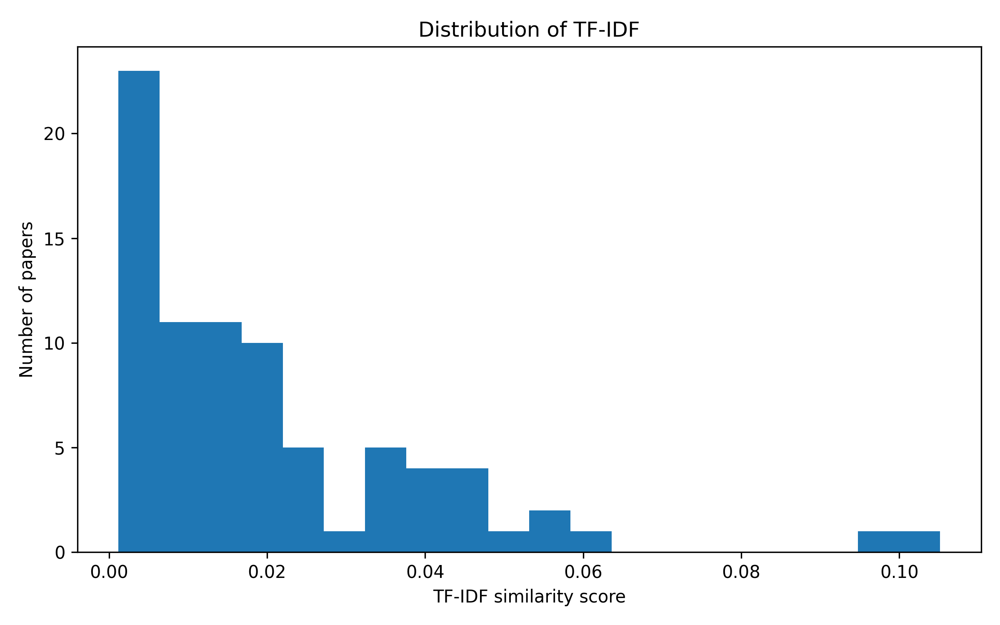
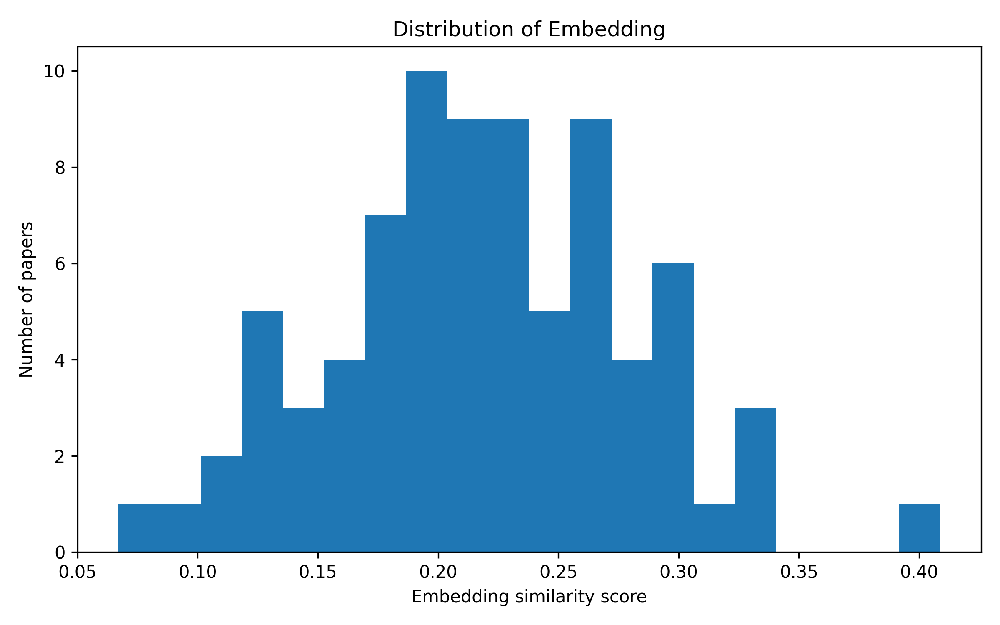
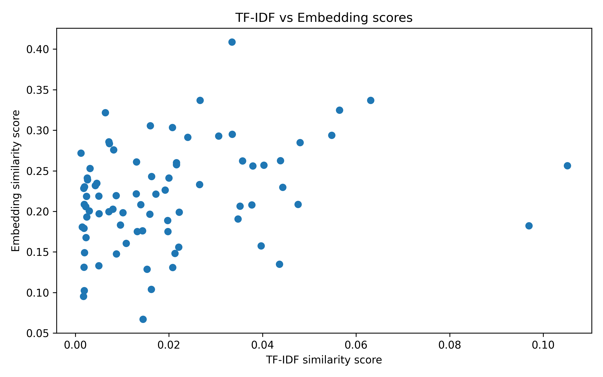

# Abstracts Lie? Measuring Thematic Alignment Between Journal Scope and Article Abstracts

## Abstract

This project studies whether article abstracts can represent the thematic focus of a scientific journal. The case study is the Journal of Machine Learning Research (JMLR). I compare the journal's official Aims & Scope text with 80 article abstracts collected from recent JMLR volumes. Two text representation methods are used: TF-IDF as a lexical baseline and transformer-based sentence embeddings as a semantic method. In both cases, cosine similarity is used to measure the alignment between the Aims & Scope and each abstract. The results show that TF-IDF similarity is low, while embedding-based similarity is higher. This suggests that article abstracts may be semantically related to the journal scope even when they use specialized terminology with limited direct word overlap.

## 1. Introduction

Article abstracts are often the first part of a scientific paper that readers see. They are also used by search engines, digital libraries, and bibliographic databases to describe the content of papers. Because of this, abstracts are frequently treated as short representations of scientific work.

However, an abstract usually describes one specific paper, while a journal's Aims & Scope describes the broader thematic identity of the journal. This creates an interesting question: do article abstracts reflect the journal's declared focus, or are they too narrow and technical to represent it well?

This project investigates this question using the Journal of Machine Learning Research (JMLR) as a case study. JMLR is a broad machine learning journal, but individual articles may focus on specialized topics such as optimization, matrix methods, dynamical systems, or theoretical learning problems. For this reason, some abstracts may not look very close to the journal's general scope, even if the papers are relevant to machine learning.

The informal title "Abstracts Lie?" is intentionally provocative. The project does not claim that abstracts are false or misleading. Instead, it measures how closely article abstracts align with the journal's official thematic description. The main goal is to understand whether abstracts can be used as reliable proxies for a journal's thematic focus.

To answer this question, I use two vector-based text representation methods. First, I apply TF-IDF, which measures similarity based mainly on word overlap. Second, I use transformer-based sentence embeddings, which capture semantic similarity between texts. Both methods are combined with cosine similarity to compute an alignment score between the JMLR Aims & Scope and each article abstract.

The project is exploratory. The objective is not to train a new model or achieve high predictive performance, but to compare how classical and modern NLP methods behave when measuring thematic alignment.

## 2. Research Question and Methodology

The main research question of this project is:

**How reliably do article abstracts represent the thematic focus declared in a journal's Aims & Scope?**

In this project, the journal's Aims & Scope is treated as the reference description of the journal's thematic identity. The article abstracts are treated as short summaries of individual papers. By comparing these two types of text, the project measures how closely the abstracts align with the journal's declared focus.

The case study is the Journal of Machine Learning Research (JMLR). JMLR was selected because it is a well-known machine learning journal and because its papers are openly available online. The dataset contains 80 article abstracts collected from recent JMLR volumes. The Aims & Scope text was taken from the official JMLR website and used as the reference text.

The data collection step extracted the title, abstract, year, and URL for each article. After collection, a preprocessing step was applied. Empty abstracts were removed, unnecessary spaces and line breaks were cleaned, and duplicate entries were removed. The final cleaned dataset contains 80 abstracts.

To measure thematic alignment, the project uses two text representation methods.

### 2.1 TF-IDF Representation

The first method is TF-IDF, which is used as a classical lexical baseline. TF-IDF represents a text as a vector based on the importance of words in the corpus. Words that appear frequently in one document but are not too common across all documents receive higher weight.

In this project, the Aims & Scope text and all article abstracts are converted into TF-IDF vectors. Then, cosine similarity is calculated between the Aims & Scope vector and each abstract vector. This produces one TF-IDF alignment score for each abstract.

TF-IDF is useful because it is simple and interpretable. However, it mainly depends on vocabulary overlap. If an abstract uses different technical terminology from the Aims & Scope, TF-IDF may assign a low score even if the abstract is still related to machine learning.

### 2.2 Transformer-Based Sentence Embeddings

The second method uses transformer-based sentence embeddings. Unlike TF-IDF, embeddings represent the meaning of a text in a dense vector space. This makes it possible to compare texts even when they do not use exactly the same words.

In this project, a pretrained sentence-transformer model is used to convert the Aims & Scope and each abstract into embedding vectors. The model is not trained during this project; it is only used to generate semantic text representations. Cosine similarity is then calculated between the Aims & Scope embedding and each abstract embedding.

This method is expected to capture semantic similarity better than TF-IDF, especially for technical abstracts that are related to machine learning but do not explicitly repeat the words used in the journal's Aims & Scope.

### 2.3 Cosine Similarity

Both methods use cosine similarity as the alignment metric. Cosine similarity measures how close two vectors are in direction. A higher score means that the abstract is more similar to the Aims & Scope according to the chosen representation method.

For each abstract, the project calculates two scores:

* a TF-IDF similarity score;
* an embedding similarity score.

These scores are then compared to understand whether lexical similarity and semantic similarity produce similar judgments. The project also analyzes low-alignment abstracts and cases where the two methods disagree.

## 3. Experimental Results

The final dataset contains 80 JMLR article abstracts. For each abstract, two alignment scores were calculated: one using TF-IDF and one using transformer-based sentence embeddings.

The main numerical results are summarized in Table 1.

| Method | Mean | Min | Max |
|---|---:|---:|---:|
| TF-IDF + cosine similarity | 0.020 | 0.001 | 0.105 |
| Embeddings + cosine similarity | 0.219 | 0.067 | 0.409 |

Table 1. Summary of alignment scores for the two methods.

### 3.1 TF-IDF Results

The TF-IDF similarity scores were generally low. The mean TF-IDF score was approximately **0.020**, with a maximum value of approximately **0.105**. This indicates that the direct vocabulary overlap between the JMLR Aims & Scope and the article abstracts is limited.

This result is expected because the Aims & Scope text is short and general, while the abstracts are much more technical and specific. For example, many abstracts focus on topics such as optimization, matrix methods, dynamical systems, and theoretical learning problems. These topics may be relevant to machine learning, but they do not always use the same broad vocabulary as the journal description.

Therefore, the TF-IDF baseline suggests that abstracts are not strongly aligned with the Aims & Scope at the lexical level.

Figure 1 presents the distribution of TF-IDF alignment scores.

Figure 1. Distribution of TF-IDF alignment scores.

### 3.2 Embedding-Based Results

The embedding-based similarity scores were higher than the TF-IDF scores. The mean embedding score was approximately **0.219**, with a maximum value of approximately **0.409**.

This suggests that the abstracts are more semantically related to the journal scope than the TF-IDF method indicates. In other words, even when abstracts do not repeat the same words as the Aims & Scope, they may still be related in meaning.

This difference between TF-IDF and embeddings is important. TF-IDF mainly captures word overlap, while transformer embeddings capture broader semantic similarity. For this reason, embeddings are more suitable for detecting thematic alignment when abstracts use specialized technical terminology.

Figure 2 shows the distribution of embedding-based alignment scores.

### 3.3 Comparison Between Methods

The correlation between TF-IDF and embedding scores was approximately **0.279**. This is a weak positive correlation.

This means that the two methods are somewhat related, but they do not produce the same ranking of abstracts. Some abstracts may have low TF-IDF scores because they use different vocabulary from the Aims & Scope, while still having moderate embedding scores because their meaning is related to machine learning.

This result supports the idea that lexical similarity and semantic similarity capture different aspects of thematic alignment.

Figure 3 compares TF-IDF and embedding scores for the same abstracts.

### 3.4 Outlier Analysis

The outlier analysis focused on abstracts with the lowest embedding-based alignment scores. These abstracts were considered the weakest semantic matches to the Aims & Scope.

The lowest-alignment abstracts included papers such as:

* *A projected semismooth Newton method for a class of nonconvex composite programs*;
* *Unlabeled Principal Component Analysis and Matrix...*;
* *Revisiting RIP Guarantees for Sketching Operators...*;
* *Decomposed Linear Dynamical Systems (dLDS)...*;
* *Convergence for nonconvex ADMM...*.

These papers are not necessarily irrelevant to JMLR. Instead, they are highly technical and often focus on mathematical optimization, matrix methods, or dynamical systems. This shows an important limitation of the approach: low alignment does not automatically mean that an abstract is off-topic. It may simply mean that the abstract uses specialized terminology that is not strongly represented in the short Aims & Scope text.

### 3.5 Interpretation

Overall, the results show that abstracts are weakly aligned with the Aims & Scope at the lexical level, but more aligned at the semantic level. This suggests that article abstracts can be useful proxies for journal thematic focus, but only to a limited extent.

The analysis also shows that the choice of text representation method matters. A classical TF-IDF approach may underestimate thematic alignment, especially when the reference text is short and general. Transformer embeddings provide a more flexible semantic comparison, but they also depend on the quality and assumptions of the pretrained model.

For this reason, the results should be interpreted as exploratory evidence rather than as a definitive judgment of whether abstracts accurately represent a journal.

## 4. Concluding Remarks

This project analyzed whether article abstracts can represent the thematic focus of a scientific journal. Using JMLR as a case study, I compared the journal's official Aims & Scope with 80 article abstracts using two text representation methods: TF-IDF and transformer-based sentence embeddings.

The results show that TF-IDF similarity scores are very low, with a mean score of approximately 0.020. This suggests that the abstracts have limited direct vocabulary overlap with the Aims & Scope. However, the embedding-based method produced higher scores, with a mean of approximately 0.219. This indicates that the abstracts are more related to the journal scope at the semantic level than at the lexical level.

The correlation between TF-IDF and embedding scores was approximately 0.279, which shows a weak positive relationship between the two methods. This means that lexical similarity and semantic similarity are related, but they do not measure exactly the same aspect of thematic alignment.

The outlier analysis showed that the lowest-alignment abstracts were often highly technical papers related to optimization, matrix methods, dynamical systems, or theoretical problems. These papers are not necessarily outside the scope of JMLR. Instead, their abstracts use specialized terminology that is not strongly represented in the short and general Aims & Scope text.

Overall, the project suggests that article abstracts can be useful indicators of a journal's thematic focus, but they should not be treated as perfect representations. The result depends strongly on the representation method used. TF-IDF may underestimate alignment when texts use different vocabulary, while embeddings provide a more flexible semantic comparison.

The main limitation of this project is that the Aims & Scope text is short and general. A richer reference description of the journal could produce more stable alignment scores. Another limitation is the dataset size, which contains 80 abstracts from recent JMLR volumes. Future work could extend the dataset, include full paper texts, compare several journals, or use more detailed topic modeling methods.

## References

1. Journal of Machine Learning Research. Official website and paper archive.  
   https://www.jmlr.org/

2. Pedregosa, F. et al. Scikit-learn: Machine Learning in Python. Journal of Machine Learning Research, 12, 2825–2830, 2011.

3. Reimers, N. and Gurevych, I. Sentence-BERT: Sentence Embeddings using Siamese BERT-Networks. EMNLP-IJCNLP, 2019.

## AI Usage Disclaimer

OpenAI's ChatGPT was used in a limited supporting role during this project. It helped me clarify NLP concepts, understand methods such as TF-IDF, sentence embeddings, and cosine similarity, and improve the organization and wording of the documentation and report. The main implementation work, code execution, debugging decisions, result generation, and interpretation were carried out by me. I manually wrote, tested, modified, and validated the project code and take full responsibility for the final content, results, and academic integrity of the project.
